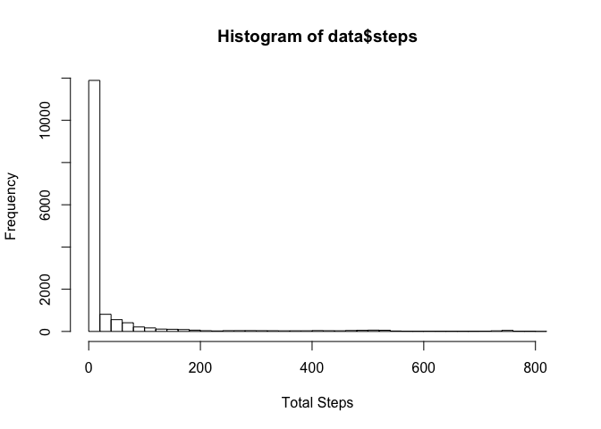
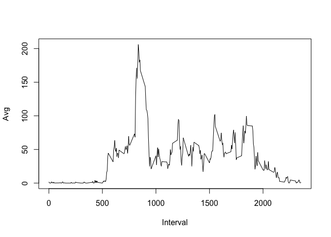
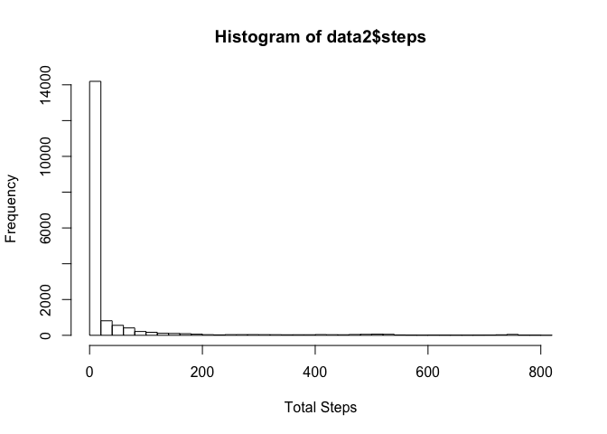
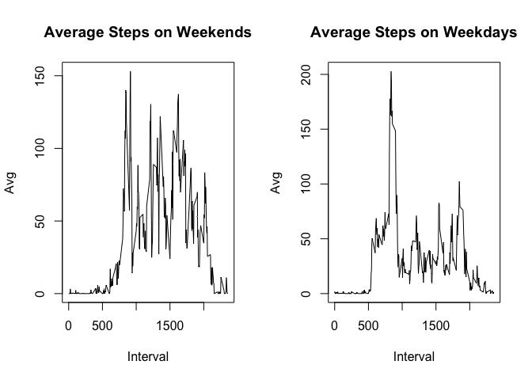

# Reproducible Research: Peer Assessment 1
### Loading and preprocessing the data
The below code will read the 'activity.zip' file into R Studio from memory, unzip the file, and then write the data to a table. This script will run independent of rdpeng's github repo https://github.com/rdpeng/RepData_PeerAssessment1.git


```r
temp <- tempfile()
download.file("https://d396qusza40orc.cloudfront.net/repdata%2Fdata%2Factivity.zip",temp)
data <- read.csv(unz(temp, "activity.csv"),stringsAsFactors = FALSE)
unlink(temp)
data$date <- as.Date(data$date, "%Y-%m-%d")
```

### What is mean total number of steps taken per day?
Below is an analysis of the number of steps that the subject took daily. For this analysis NAs were ignored.

**Calculate the total number of steps**


```r
library(data.table)
x <- na.omit(data)
x <- data.table(x)
x <- x[, mean(steps), by=date]
colnames(x) <- c("Date","Avg Steps")
x
```

```
##           Date  Avg Steps
##  1: 2012-10-02  0.4375000
##  2: 2012-10-03 39.4166667
##  3: 2012-10-04 42.0694444
##  4: 2012-10-05 46.1597222
##  5: 2012-10-06 53.5416667
##  6: 2012-10-07 38.2465278
##  7: 2012-10-09 44.4826389
##  8: 2012-10-10 34.3750000
##  9: 2012-10-11 35.7777778
## 10: 2012-10-12 60.3541667
## 11: 2012-10-13 43.1458333
## 12: 2012-10-14 52.4236111
## 13: 2012-10-15 35.2048611
## 14: 2012-10-16 52.3750000
## 15: 2012-10-17 46.7083333
## 16: 2012-10-18 34.9166667
## 17: 2012-10-19 41.0729167
## 18: 2012-10-20 36.0937500
## 19: 2012-10-21 30.6284722
## 20: 2012-10-22 46.7361111
## 21: 2012-10-23 30.9652778
## 22: 2012-10-24 29.0104167
## 23: 2012-10-25  8.6527778
## 24: 2012-10-26 23.5347222
## 25: 2012-10-27 35.1354167
## 26: 2012-10-28 39.7847222
## 27: 2012-10-29 17.4236111
## 28: 2012-10-30 34.0937500
## 29: 2012-10-31 53.5208333
## 30: 2012-11-02 36.8055556
## 31: 2012-11-03 36.7048611
## 32: 2012-11-05 36.2465278
## 33: 2012-11-06 28.9375000
## 34: 2012-11-07 44.7326389
## 35: 2012-11-08 11.1770833
## 36: 2012-11-11 43.7777778
## 37: 2012-11-12 37.3784722
## 38: 2012-11-13 25.4722222
## 39: 2012-11-15  0.1423611
## 40: 2012-11-16 18.8923611
## 41: 2012-11-17 49.7881944
## 42: 2012-11-18 52.4652778
## 43: 2012-11-19 30.6979167
## 44: 2012-11-20 15.5277778
## 45: 2012-11-21 44.3993056
## 46: 2012-11-22 70.9270833
## 47: 2012-11-23 73.5902778
## 48: 2012-11-24 50.2708333
## 49: 2012-11-25 41.0902778
## 50: 2012-11-26 38.7569444
## 51: 2012-11-27 47.3819444
## 52: 2012-11-28 35.3576389
## 53: 2012-11-29 24.4687500
##           Date  Avg Steps
```

**Histogram of total steps per day**
For this plot, NAs were *not* omitted


```r
hist(data$steps, breaks=30, xlab="Total Steps")
```

 

**Mean & median total # of steps by day**
Calculate and report the mean and median of the total number of steps taken per day. NAs are *not* omitted


```r
summary(data$steps)
```

```
##    Min. 1st Qu.  Median    Mean 3rd Qu.    Max.    NA's 
##    0.00    0.00    0.00   37.38   12.00  806.00    2304
```

### What is the average daily activity pattern?

**Create a time series of 5-minute intervals against avg. # of steps**
NAs were omitted for this step in order to get the average # of steps over multiple intervals


```r
tmp <- na.omit(data)
tmp <- data.table(tmp)
tmp <- tmp[, mean(steps), by = interval]
colnames(tmp) <- c("Interval", "Avg")
plot(Avg ~ Interval, tmp, type = "l")
```

 

**Which interval, on average, contains the most steps?**

```r
tmp <- tmp[order(-tmp$Avg),]
tmp[1]
```

```
##    Interval      Avg
## 1:      835 206.1698
```

### Imputing missing values
This series of questions aims to address the large number of NAs that exist within our data set. The following questions will summarize and remediate this form of bias.

**Calculate and report the total number of missing values**

```r
sum(is.na(data$steps))
```

```
## [1] 2304
```

**Come up with a strategy for filling in the NAs**
All of the NA values will be replaced by Os. Looking at the time series data, it is clear that the NAs occur when the subject is sleeping. Thus, they log 0 steps.

**Create a new data set with the values filled in**

```r
data2 <- data
data2[is.na(data2)] <- 0
```

**Make a histogram of the total # of steps taken each day**

```r
hist(data2$steps, breaks=30, xlab="Total Steps")
```

 

```r
summary(data2)
```

```
##      steps             date               interval     
##  Min.   :  0.00   Min.   :2012-10-01   Min.   :   0.0  
##  1st Qu.:  0.00   1st Qu.:2012-10-16   1st Qu.: 588.8  
##  Median :  0.00   Median :2012-10-31   Median :1177.5  
##  Mean   : 32.48   Mean   :2012-10-31   Mean   :1177.5  
##  3rd Qu.:  0.00   3rd Qu.:2012-11-15   3rd Qu.:1766.2  
##  Max.   :806.00   Max.   :2012-11-30   Max.   :2355.0
```

Do the data the mean & median values differ from the estimates in the beginning of the assignment?
- Yes. By replacing the NAs with 0s, the mean has gone down. The median remains the same because the NA is represented as 0 when looking at the summary
- The impact of imputing values depends on how you imputed that value. By replacing NAs with 0s, the average was driven down. A better approach would be to identify and eliminate outliers in the data set. This eliminates bias without introducing an imputed value

### Are there differences in activity patterns between weekdays and weekends?
For this question, I will create a new factor variable in the data table that determines of the date is a weekday or a weekend. This factor will then be the driving variable in a 2 panel plot to compare the two.

**Make 2 factor variables for 'weekend' and 'weekday'**

```r
weekdays <- c('Monday', 'Tuesday', 'Wednesday', 'Thursday', 'Friday')
data2$weekday <- factor((weekdays(data2$date) %in% weekdays), levels=c(FALSE, TRUE), labels=c('weekend', 'weekday'))
```

**Make a panel plot comparing the weekend & weekday activity**


```r
tmp_weekday <- subset(data2, weekday == "weekday")
tmp_weekday <- data.table(tmp_weekday)
tmp_weekday <- tmp_weekday[, mean(steps), by=interval]
colnames(tmp_weekday) <- c("Interval", "Avg")

tmp_weekend <- subset(data2, weekday == "weekend")
tmp_weekend <- data.table(tmp_weekend)
tmp_weekend <- tmp_weekend[, mean(steps), by=interval]
colnames(tmp_weekend) <- c("Interval", "Avg")

par(mfrow=c(1,2))
plot(Avg ~ Interval, tmp_weekend, main="Average Steps on Weekends", type = "l")
plot(Avg ~ Interval, tmp_weekday, main="Average Steps on Weekdays", type = "l")
```

 
